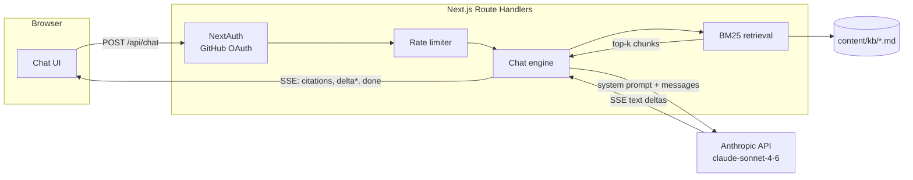

# AIStack

A retrieval-grounded AI chat application with server-side token streaming, cited sources, and GitHub sign-in.

[](https://github.com/samer-br/aistack/actions/workflows/ci.yml)

**Live demo:** [add-your-deployed-url-here](https://example.com)

## Overview

AIStack is a small, self-contained chat product: a Next.js frontend streams
answers from Claude, grounded in a bundled markdown knowledge base rather than
the model's own memory. Every answer shows which document sections it drew
from, so users can verify a claim instead of trusting it blindly.

The knowledge base here documents a fictional developer platform ("Nimbus"),
which keeps the demo self-contained without depending on any external service
at runtime.

## Features

- Token-by-token streaming over Server-Sent Events, rendered as it arrives
- Retrieval-augmented answers with inline citations back to source sections
- GitHub OAuth sign-in gating the chat behind an authenticated session
- Per-user rate limiting on the chat endpoint
- Suggested-questions row for a fast first interaction
- Light/dark aware UI built with Tailwind CSS
- Fully offline test suite - no network calls, no API key required
- Zero-config local run: falls back to guest sign-in and a demo response
  when no GitHub OAuth app or Anthropic key is configured

## How it works

1. The client posts the conversation so far to `POST /api/chat`.
2. The route handler checks the session (NextAuth), applies a per-user rate
   limit, and takes the last user message as the retrieval query.
3. A BM25 index built from `content/kb/*.md` returns the top-scoring chunks.
   Those chunks become the system prompt's reference material, and their
   source/heading pairs become the citations returned to the client.
4. The server calls the Anthropic Messages API with streaming enabled and
   forwards each text delta to the client as an SSE frame, followed by a
   citations frame and a done frame.
5. The client renders deltas as they arrive and lists the citations under the
   finished answer.



## Tech stack

- Next.js 16 (App Router) + TypeScript
- Tailwind CSS 4
- NextAuth 4 (GitHub OAuth provider)
- Anthropic SDK, streamed server-side only
- In-memory BM25 retrieval (no vector database)
- Jest + Testing Library for fully offline tests
- GitHub Actions CI, Docker for local/self-hosted runs

## Running locally

```bash
npm install
npm run dev
```

Open `http://localhost:3000`. With no environment variables set at all, the
app runs end to end: sign-in falls back to a local guest session, and chat
answers fall back to a canned response built from the retrieved knowledge
base sections instead of a real model call. This is the fastest way to see
the retrieval, streaming, and citation flow working.

To use real GitHub sign-in and real model-generated answers, copy
`.env.example` to `.env.local` and fill in `ANTHROPIC_API_KEY` and a GitHub
OAuth app's `GITHUB_ID` / `GITHUB_SECRET` (callback URL
`http://localhost:3000/api/auth/callback/github`). Each falls back
independently, so you can set just one and get the other's fallback.

### Tests

```bash
npm test     # runs fully offline; the Anthropic client is stubbed
npm run lint
npm run build
```

### Docker

```bash
docker compose up --build
```

## Deploying to Vercel

1. Import the repository into Vercel.
2. Set environment variables: `ANTHROPIC_API_KEY`, `ANTHROPIC_MODEL`
   (optional), `NEXTAUTH_SECRET`, `NEXTAUTH_URL` (your deployed URL),
   `GITHUB_ID`, `GITHUB_SECRET`.
3. Update the GitHub OAuth app's callback URL to
   `https://<your-domain>/api/auth/callback/github`.
4. Deploy. Route handlers run as Vercel Functions; no other infrastructure is
   required.

## Key decisions

**BM25 over a vector database.** The knowledge base is a few dozen short
sections, well within the range where lexical scoring (BM25) retrieves as
well as embeddings would, without a vector store, an embedding API call, or
extra latency. This stops being the right call once the corpus grows into
the thousands of documents or needs semantic matching across paraphrases.

**In-memory rate limiting over Redis.** A per-instance `Map` is enough for a
single-region demo deployment and keeps the app dependency-free. It resets on
redeploy and doesn't coordinate across multiple instances, which is the
tradeoff a real multi-instance production deployment would need to revisit
with a shared store.

**NextAuth v4 over v5.** v5 (Auth.js) has a friendlier App Router API, but its
current release channel is still in beta. v4's `getServerSession` /
`NextAuthOptions` pattern is a few more lines of code in exchange for a
stable, widely-deployed API - the right tradeoff for something meant to run
unattended as a live demo.

## License

MIT
